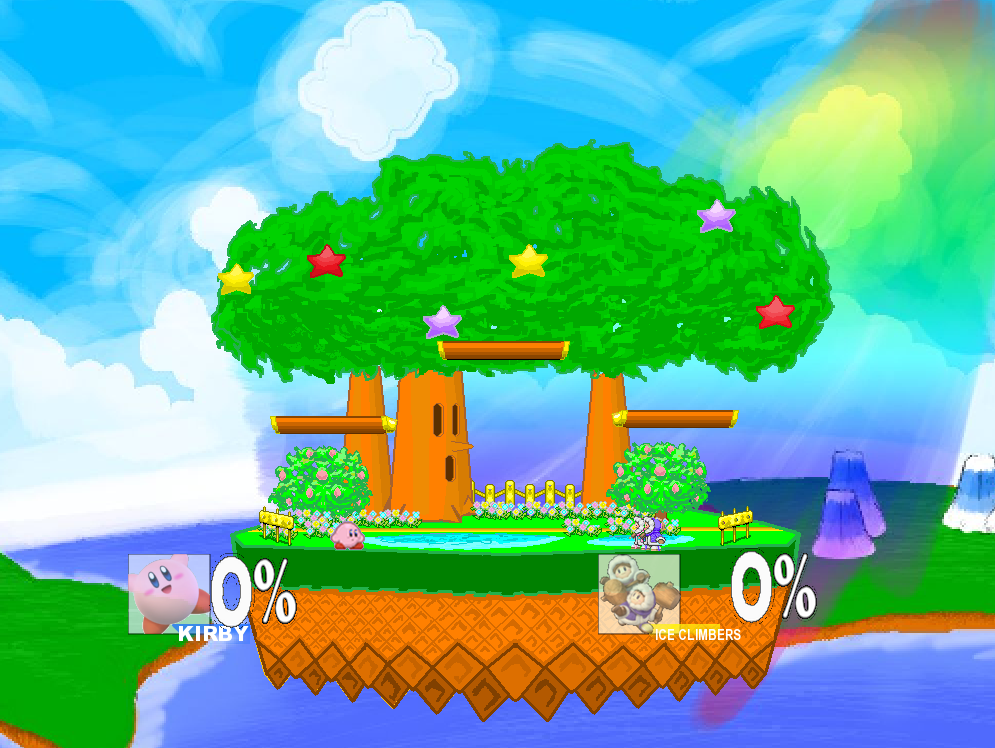

# Super Smash Bros
A two player game based off of the popular Nintendo game, Super Smash Brothers. This version of the game utilizes the [ucigame library] (http://www.ucigame.org/). 

##Screenshot

##Controls
Combinations of the direction keys and the attack keys may lead to special attacks. Experiment with the game to find out all moves (e.g. `Left` and `>` will give Kirby a hammer).

****Player 1: Kirby
1. `Up`: Up
2. `Down`: Down Attack (Weight)
3. `Left`: Left
4. `Right`: Right
5. `>` : Attack Style 1
6. `<` : Attack Style 2

****Player 2: Ice Climbers
1. `W`: Up
3. `A`: Left
4. `D`: Right
5. `R`: Attack Style 1
6. `T`: Attack Style 2

##License
This version of Super Smash Bros is licensed under the MIT License.

Copyright (c) 2013 Lilly Wang

Permission is hereby granted, free of charge, to any person obtaining a copy
of this software and associated documentation files (the "Software"), to deal
in the Software without restriction, including without limitation the rights
to use, copy, modify, merge, publish, distribute, sublicense, and/or sell
copies of the Software, and to permit persons to whom the Software is
furnished to do so, subject to the following conditions:

The above copyright notice and this permission notice shall be included in
all copies or substantial portions of the Software.

THE SOFTWARE IS PROVIDED "AS IS", WITHOUT WARRANTY OF ANY KIND, EXPRESS OR
IMPLIED, INCLUDING BUT NOT LIMITED TO THE WARRANTIES OF MERCHANTABILITY,
FITNESS FOR A PARTICULAR PURPOSE AND NONINFRINGEMENT. IN NO EVENT SHALL THE
AUTHORS OR COPYRIGHT HOLDERS BE LIABLE FOR ANY CLAIM, DAMAGES OR OTHER
LIABILITY, WHETHER IN AN ACTION OF CONTRACT, TORT OR OTHERWISE, ARISING FROM,
OUT OF OR IN CONNECTION WITH THE SOFTWARE OR THE USE OR OTHER DEALINGS IN
THE SOFTWARE.